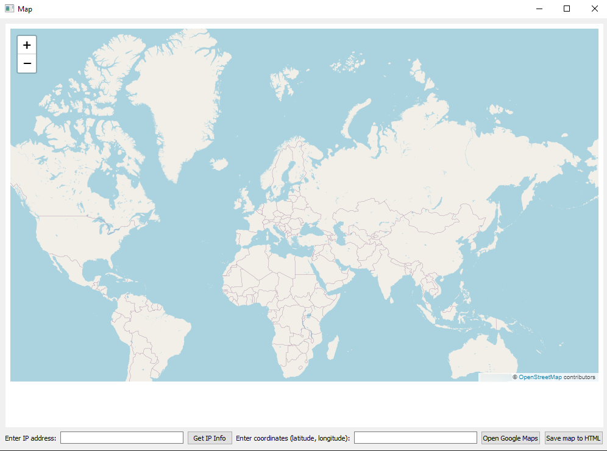

# IPMapper
A simple program that allows the user to find out the coordinates using an IP and immediately mark it on the map using a point. The program also supports entering your own coordinates for the mark. [The map can be saved as an html file]

## GUI

